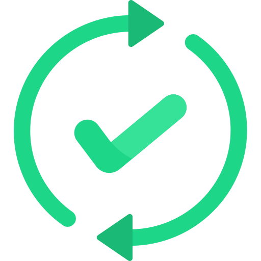

#  **Roadmap's Criteria | IEEE Mansoura Computer Sociiety Chapter (2023)**

A Roadmap is a valuable tool for students as it aims for setting a specific and well-organized plan to study a specific track. In order to ensure roadmap's effectiveness, we have set a set of criteria that we will explain in this document. 

الرودماب هو أداة قيمة للطلاب حيث يهدف إلى وضع خطة محددة ومنظمة لدراسة مسار معين. ولضمان فعالية الرودماب، وضعنا مجموعة من المعايير التي سنشرحها في هذا المستند.
 
 

These criteria should include a thorough assessment of the student's academic strengths and weaknesses, a realistic timeline for completing coursework, and a flexible plan for regular review and updates. 

يجب أن تشمل هذه المعايير تقييما شاملا لنقاط قوة وضعف الطالب الأكاديمية، وجدول زمني واقعي لإكمال الدورات، وخطة مرنة للمراجعة والتحديثات الدورية.

 

## **Why should we follow these criteria?**
---
 

  

 

By following these criteria, an expert can create a roadmap that serves as:
- A comprehensive guide for achieving academic success.
- A clear outline of courses, assignments, and projects necessary to gain the needed skills and knowledge to work in in the specified track.
- A clear plan that helps you accommodate unexpected changes or challenges that may arise throughout the learning journey. 
- A well-designed study roadmap, so that students can stay on track, remain focused, and achieve their goals.

باتباع هذه المعايير، يمكن للخبير إنشاء رودماب يعمل كما يلي:

<ul>
  <li>دليل شامل لتحقيق النجاح الأكاديمي.</li>
  <li>مخطط واضح للدورات والمهام والمشاريع اللازمة لاكتساب المهارات والمعرفة اللازمة للعمل في المجال المحدد.</li>
  <li>خطة واضحة تساعدك على التكيف مع التحديات أو التغييرات غير المتوقعة التي قد تنشأ خلال الرحلة التعليمية.</li>
  <li>رودماب دراسي مصمم بشكل جيد، حتى يتمكن الطلاب من البقاء على المسار الصحيح، والتركيز، وتحقيق أهدافهم.</li>
</ul>

 

## **What are the Roadmap Criteria?**
---
In IEEE Mansoura Computer Society Chapter, we follow 11 Criteria in our roadmaps:

في IEEE Mansoura Computer Society Chapter نتبع المعايير الـ11 الآتية في الـRoadmap لكل لجنة:

  

  

  
### **1. Based on specific on-demand position**
  

The purpose of the roadmap is to qualify for a specific job title that is required in the current job market.

تكون الرودماب مبنية بهدف إنها تأهل لمسمى وظيفي محدد ومطلوب في سوق العمل الحالي

  

  

  
  ### **2. Based on Milestones, & each milestone is goal-based**
  

The roadmap is divided into multiple parts, where each part (milestone) has a specific timeline, a set of materials to be studied, a set of tasks for each fundamental point, and a goal that helps achieve the committee's main objective.

تكون الرودماب متقسمة لأكتر من جزء, كل جزء - milestone - له وقت محدد ومجموعة من الماتيريال اللي هتتذاكر ومجموعة من التاسكات لكل نقطة أساسية وله هدف بيساعد في تحقيق الهدف الأساسي للجنة

  

  

  
### **3. Timeline-based**

  

There is an explicit timeline that clarifies the average time needed for each part in a semi-detailed manner.

يوجد خطة زمنية صريحة بتوضح الوقت المتوسط اللازم لكل جزء بشكل شبه مفصل

  

  

  
### **4. Tasks & Progress**

  

After each part in the plan - a week or more or less, as determined by the leader - there are tasks or projects that measure their success in understanding the content and their progress in the roadmap.

يكون بعد كل جزء في البلان - أسبوع أو أكثر أو أقل حسب تحديد الليدر - يوجد تاسكات أو مشاريع تقيس مدي نجاحهم في فهم المحتوي وتقدمهم في الرودماب

  

  

  
### **5. Balance between the theory and the practical aspects**

  

Balancing between the theoretical and practical aspects in the roadmap.

 الموازنة بين الجانب النظري و العملي في الرودماب

  

  

  
### **6. Up to date**

  

The roadmap should include the latest updates in the job market related to the field.

 أن تكون الرودماب شاملة آخر التحديثات الموجودة في سوق العمل الخاص بالمجال 

  

  

  
### **7. Need normal amount of time & effort**

  

Studying the roadmap according to the designated timeline requires an average amount of effort and time for an individual with average capabilities, such that it does not cause pressure or laziness for the person.

 إن مذاكرة الرودماب علي التايملاين المخصص لها تحتاج مجهود ووقت متوسطين لشخص ذي إمكانيات متوسطة بحيث لا تسبب ضغط أو خمول للشخص.

  

  

  
### **8. Project-based**

  

There should be a project after each milestone to ensure familiarity with the content of the milestone.

أن يكون هناك مشروع بعد كل milestone للتأكد من الإلمام بمحتوي ال milestone

  

  

  
### **9. Contains main resources, and secondary ones for any other cases**

  

It should contain primary sources for studying that will be followed within each committee, as well as additional sources in case of difficulty in understanding the primary source or for any other reason.

تحتوي على مصادر أساسية للمذاكرة والتي سيتم إتباعها داخل كل لجنة. ووجود مصادر إضافية في حالة صعوبة الفهم من المصدر الأساسي أو لأي سبب آخر.

  

  

  
### **10. All the resources are free and legal to use**

  

All sources for the content and tasks required in the roadmap must be used legally and entirely free to avoid any legal or religious doubts.

يجب أن تكون جميع المصادر للمحتوى والتاسكات المطلوبة في الرودماب تكون مستخدمة بشكل قانوني ومجاني كامل تجنباً لأي شبهات شرعية أو قانونية

  

  

  
### **11. Easy to navigate through all weeks, content & tasks**

  

It should be organized and structured in a way that facilitates the learner's navigation through all weeks, content, tasks, and projects. The goal of each week should be clear and explicitly stated.

يجب أن تكون مُرتبَة ومنظمة بحيث تُسهِل على المُتعَلِم تصفح جميع الأسابيع والمحتوى والتاسكات والمشاريع ويجب أن يكون الهدف من كل أسبوع واضح ومذكور بشكل مباشر

## **Roadmap Template**
---
> We have created a template that applys these criteria in a practical example that any expert can follow to create a well-organized project-based roadmap for learning a specific track Check the template from [here]().

## **IEEE ManCSC Roadmaps**
---
> Check our roadmaps from [here](https://github.com/IEEE-ManCSC/Computer-Science-Tracks-Roadmaps).

## **Contacts**
---
- [csc.ieeemansb.org](csc.ieeemansb.org)
- [FaceBook](https://www.facebook.com/ieeemancsc)
- [LinkedIn](https://www.linkedin.com/company/ieeemancsc/)
- [YouTube](https://www.youtube.com/channel/UCqXBZM5eGl7fs1Vzwvlc8CQ)
- Gmail : ieeemancsc@gmail.com